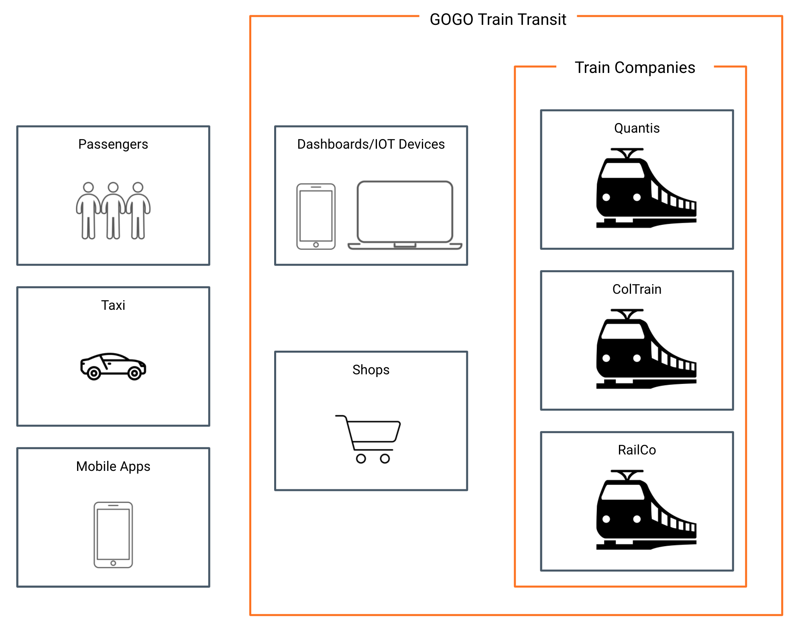
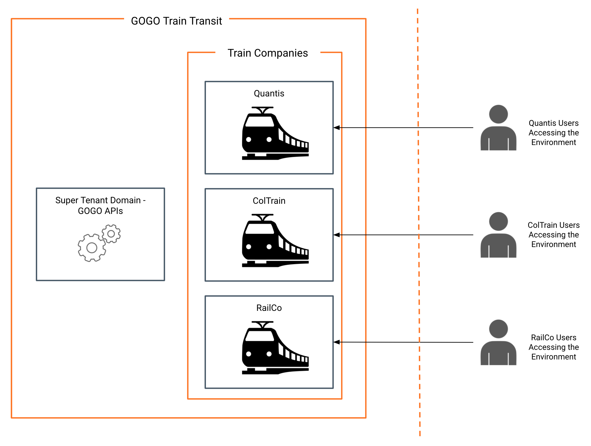

## Authors

- [@Dushan Abeyruwan](https://github.com/dushansachinda)


# Accelerate Digital Adoption Through API-led Integration workshop

The shift to digital enables organizations to quickly deliver innovative products and services. As part of this voyage, enterprises must develop their digital transformation blueprints to achieve their business goals. 

Organizations are growing their capacities by implementing infrastructure as a service (IaaS) through the cloud using software as a service (SaaS) applications to upgrade their legacy systems. In both scenarios, the use of APIs for integrations has significantly increased – through REST or event-driven architecture (Streaming API capabilities) or GraphQLs, which is a perfect fit for these various scenarios. At the same time, it’s critical to create an API strategy and use technical capabilities to meet current and future business needs.

In this session, we will explore:
* How to create a successful integration and API strategy for digital adoption
* How WSO2 can help enforce your strategy
* Aspects of API-led integration through the WSO2 API management platform in the context of digital adoption, referring to concepts such as event-driven architecture (streaming APIs) and GraphQL
  * Creating, life-cycle management, versioning, security, and governance of APIs
  * Supporting real-time integrations and APIs - AsyncAPI support
  * Managing GraphQL APIs - security, subscription and governance
* Deploy and manage large-scale distributed systems employing a cloud-native, decentralized, lightweight API gateway designed especially for microservices
  *  Centralized and decentralized deployments of APIs and integrations - using Docker and Kubernetes and API Operator for Kubernetes
  * DevOps tooling for managing environments, APIs, and pipelines


## Requirements

 - [WSO2 API Manager](https://wso2.com/api-manager/)
 - [WSO2 Micro Integrtor](https://wso2.com/api-manager/)
 - [WSO2 streaming Integrator](https://wso2.com/api-manager/)
 - [WSO2 Integration Studio](https://wso2.com/api-management/tooling/)
 - [Choreo Connect](https://wso2.com/api-manager/)
 - [WSO2 API Controller](https://wso2.com/api-management/tooling/)
 - [Backends-Tomcat](https://hub.docker.com/repository/docker/dushansachinda/tomcat)
 - [MySQL database preloaded](https://hub.docker.com/repository/docker/dushansachinda/mysql-8)


## Demo

### Setup
#### backend
To build backend docker image run following command navigate to [backends](https://github.com/dushansachinda/workshop_apim_2022/blob/main/backends/Dockerfile)
```bash
docker build -t tomcat .
```

Then run the container with following command

```bash
docker run -d -p 8082:8080 tomcat:latest
```

For Mac M1 chp users may use following command to download pre-build image

 ```bash
  docker run -d -p 8082:8080 dushansachinda/tomcat:backend

  curl "http://localhost:8082/train-operations/v1/schedules"
 ```
#### mysql
 ```bash
   docker run -d -p 8083:3306 dushansachinda/mysql-8:latest
   docker exec -it [containerid] mysql -uroot -p
 ```

 #### WSO2 APIM 4.0.0 pre-loaded with tenents
You may also can start vanila API Manager 4.0 container following the command given below;
Pleae note that, if you start vanila node, then you need to run [Setup](https://github.com/dushansachinda/Accelerate_Digital-Adoption_Through-API-led-Integration_workshop/blob/main/scripts/setup.sh) scripts that will generate the tenants users required for scenarios

p.s pleaseu use following command to setup ENV properties prior to run setup.sh
 ```bash
 export APIM_HOST=localhost RETRY_SEC=10 RE_RUN=true
```

``` 
docker run -it \
   -p 9443:9443 \
   -p 8243:8243 \
   -p 8280:8280 \
   wso2am/wso2am:4.0.0-ubuntu
```

alternativly, you can run pre-configured APIM image by using following command (for Mac M1 chip)
 ```bash
   docker run -it \
   -p 9443:9443 \
   -p 8243:8243 \
   -p 8280:8280 \
   -v "[source deployment.toml]:/home/wso2carbon/wso2am-4.0.0/repository/conf"  \
   dushansachinda/wso2am:4.0.0-ubuntu
 ```
You can log in to the Publisher Portal and Developer Portal using each tenant's credentials.
Publisher portal: https://localhost:9443/publisher/ Developer portal: https://localhost:9443/devportal

To access Publisher tenants use following link

``` 
https://localhost:9443/publisher?tenant=quantis.com
https://localhost:9443/publisher?tenant=coltrain.com
https://localhost:9443/publisher?tenant=railco.com
```

 ### WSO2 Micro Integrator
 ```bash
docker build -t mi-4.0.0 .

docker run -d -p 8253:8253 -p 8290:8290 -p 9201:9201 mi-4.0.0:latest
```

Run docker image passing  evniroment variables (this may not working for users with Mac M1 chip)

pre configured MI image
```
https://hub.docker.com/layers/200402421/dushansachinda/mi-4.0.0/demo/images/sha256-870472393ad7d95a4cb1527d0fd63b887c7a3cca36810a4fbe31edfc1bce1cee?context=repo
```

 ```bash
docker run -e CATERING_SERVICE_EP="http://www.urldoesnotexist.com" -e SMTP_PORT="465" -e SMTP_HOST="smtp.gmail.com" -e EMAIL_FROM="[from_email]" -e EMAIL_TO="to_email" -e SMTP_USERNAME="[username" -e SMTP_PASSWORD="[password]" -p 8253:8253 -p 8290:8290 -p 9201:9201 dushansachinda/mi-4.0.0:demo

```

### Scenario Overview

Union Station is a major multimodal railway transportation hub. It is one of the busiest stations in the country and serves thousands of passengers a day. The train shed, platforms, and tracks are owned by GOGO transit, and they operate the station. Trains are owned by the companies named Quantis, ColTrain, and RailCo. To provide a digital ecosystem, all four companies are planning to develop their day to day business operations with WSO2 technology. These development ranges from providing different kinds of APIs to external/internal users, providing real time notifications, stream data processing, integrating with partners/external systems etc.



### Deployment View


### Users

|  | Admin |Publisher |Dev Portal |
| :---: | :--- |:--- |:---   
|Quantis|admin@quantis.com| apiprovider@quantis.com <br/>andy@quantis.com|devuser@quantis.com <br/> bob@quantis.com <br/>sindy@quantis.com <br/>logan@quantis.com|
|ColTrain|admin@coltrain.com|apiprovider@coltrain.com |devuser@coltrain.com <br/> george@coltrain.com|
|RailCo|admin@railco.com|apiprovider@railco.com<br/>jill@railco.com|devuser@railco.com<br/>tom@railco.com|

(admin user password: admin , other user password : user123)

## Scenarios

- [Scenario 1: Create a REST API from an OpenAPI Definition](https://apim.docs.wso2.com/en/latest/tutorials/scenarios/scenario1-create-rest-api/)
- [Scenario 2: Engage Access Control to the API](https://apim.docs.wso2.com/en/latest/tutorials/scenarios/scenario2-access-control/)
- [Scenario 3: Implementing an API](https://apim.docs.wso2.com/en/latest/tutorials/scenarios/scenario3-implementing-an-api/)
- [Scenario 4: Signing up a New User](https://apim.docs.wso2.com/en/latest/tutorials/scenarios/scenario4-user-signup-approval-flow/)
- [Scenario 5: Getting the Developer Community Involved](https://apim.docs.wso2.com/en/latest/tutorials/scenarios/scenario5-developer-community-feature/)
- [Scenario 6: Integrating with Data Sources](https://apim.docs.wso2.com/en/latest/tutorials/scenarios/scenario6-integrating-with-data-sources/)
- [Scenario 7: Analytics](https://apim.docs.wso2.com/en/latest/tutorials/scenarios/scenario7-analytics/)
- [Scenario 8: Rate Limiting](https://apim.docs.wso2.com/en/latest/tutorials/scenarios/scenario8-rate-limiting/)
- [Scenario 9: Realtime Data with WebSocket API](https://apim.docs.wso2.com/en/latest/tutorials/scenarios/scenario9-realtime-data/)
- [Scenario 10: Notifications Using Webhooks](https://apim.docs.wso2.com/en/latest/tutorials/scenarios/scenario10-notifications-webhooks/)
- [Scenario 11: GraphQL Support](https://apim.docs.wso2.com/en/latest/tutorials/scenarios/scenario11-graphql/)
- [Scenario 12: Gauranteed Message Delivery](https://apim.docs.wso2.com/en/latest/tutorials/scenarios/scenario12-message-delivery/)
- [Scenario 13: Integrate with Services via Connectors](https://apim.docs.wso2.com/en/latest/tutorials/scenarios/scenario13-integrate-with-connectors/)
- [Scenario 14: External Key Manager Support](https://apim.docs.wso2.com/en/latest/tutorials/scenarios/scenario14-external-key-manager/)
- [Scenario 15: Deploy and manage large-scale distributed systems employing a cloud-native, decentralized, lightweight API Gateway (Choreo-connect)](https://apim.docs.wso2.com/en/latest/deploy-and-publish/deploy-on-gateway/choreo-connect/getting-started/choreo-connect-overview/)
- [Scenario: 16: Devops CICD pipelines](https://apim.docs.wso2.com/en/latest/install-and-setup/setup/api-controller/building-jenkins-ci-cd-pipeline-for-dev-first-approach/)
